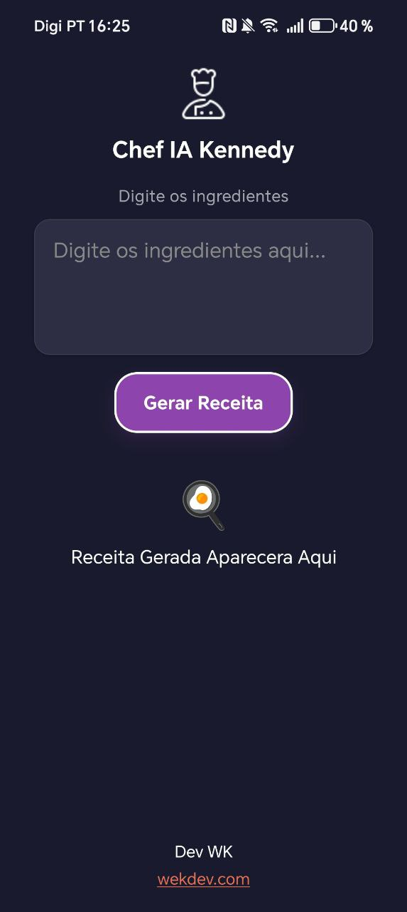

# Chef IA Kennedy



## Descrição

Chef IA Kennedy é um aplicativo móvel desenvolvido em React Native com Expo que utiliza inteligência artificial para gerar receitas deliciosas com base nos ingredientes fornecidos pelo usuário. O app integra a API Groq para processar as solicitações e criar receitas personalizadas em português do Brasil.

## Funcionalidades

- **Entrada de Ingredientes**: Permite ao usuário inserir uma lista de ingredientes disponíveis.
- **Geração de Receitas**: Utiliza IA para criar receitas completas, incluindo tempo de preparo, porções, lista de ingredientes e modo de preparo.
- **Interface Intuitiva**: Design moderno com tema escuro, fácil de usar.
- **Suporte Multiplataforma**: Compatível com iOS, Android e Web via Expo.

## Tecnologias Utilizadas

- **React Native**: Framework para desenvolvimento de apps móveis.
- **Expo**: Plataforma para desenvolvimento e build de apps React Native.
- **Axios**: Biblioteca para fazer requisições HTTP à API Groq.
- **Groq API**: Serviço de IA para geração de texto usando o modelo Llama 3.1.

## Pré-requisitos

- Node.js (versão 14 ou superior)
- Expo CLI
- Conta na Groq para obter uma chave de API

## Instalação

1. Clone o repositório:
   ```
   git clone https://github.com/seu-usuario/chef-ia.git
   cd chef-ia
   ```

2. Instale as dependências:
   ```
   npm install
   ```

3. Configure a chave de API:
   - Crie um arquivo `.env` na raiz do projeto.
   - Adicione sua chave de API da Groq: `GROQ_API_KEY=sua_chave_aqui`
   - Certifique-se de que `.env` está no `.gitignore` para não subir a chave para o GitHub.

4. Inicie o app:
   ```
   npm start
   ```

## Uso

1. Abra o app no seu dispositivo ou emulador.
2. Digite os ingredientes disponíveis no campo de texto.
3. Pressione o botão "Gerar Receita".
4. A receita gerada aparecerá na tela.

## Scripts Disponíveis

- `npm start`: Inicia o servidor de desenvolvimento Expo.
- `npm run android`: Inicia o app no Android.
- `npm run ios`: Inicia o app no iOS.
- `npm run web`: Inicia o app na web.

## Contribuição

Contribuições são bem-vindas! Sinta-se à vontade para abrir issues e pull requests.

## Desenvolvedor

Desenvolvido por [Dev WK](https://wekdev.com).

## Licença

Este projeto é privado e não possui licença pública.</content>
<parameter name="filePath">c:\Users\Fujitsu\Desktop\react native\chef-ia\README.md